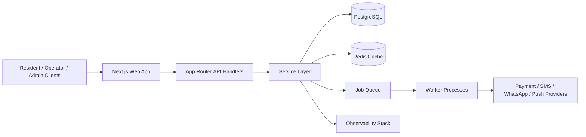

# Wash N Press Platform Architecture

## 1. Purpose
This document describes the current architecture of the Wash N Press platform and the target improvements required for production readiness.

## 2. Technology Stack
- Framework: Next.js 16 (App Router)
- UI: React 19 + Tailwind CSS v4
- Language: TypeScript (strict mode enabled)
- Validation: Zod
- Testing: Vitest + V8 coverage

## 3. High-Level Architecture
Current architecture is a frontend-first MVP with API route stubs and domain rule utilities.

- Presentation layer: route pages and reusable components
- Domain layer: business-rule functions in src/lib/domain.ts
- Data layer: in-memory mock data in src/lib/mock-data.ts and src/lib/experience-data.ts
- API layer: Next.js route handlers in src/app/api/**/route.ts

### Runtime flow
1. UI pages render using static datasets.
2. API routes validate payloads using Zod.
3. Domain functions enforce rule logic (slot selection, OTP checks, mismatch checks, sustainability summary).
4. Responses are returned directly from in-memory data.

## 4. Folder Structure

```text
washnpress-platform/
  src/
    app/
      api/
        operations/qc/route.ts
        schedule/route.ts
        sustainability/route.ts
      admin/page.tsx
      login/page.tsx
      operations/page.tsx
      resident/page.tsx
      layout.tsx
      page.tsx
    components/
      providers/
      ui/
      widgets/
      app-shell.tsx
      kpi-card.tsx
    lib/
      domain.ts
      domain.test.ts
      experience-data.ts
      mock-data.ts
      types.ts
      utils/
    test/
      setup.ts
```

## 5. Frontend Architecture
### Strengths
- Clean separation between UI primitives, widgets, and route pages.
- Consistent shell/navigation model using AppShell.
- Domain logic extracted out of pages for key rules.

### Current limitations
- Many pages are static/demo-driven and not connected to transactional state.
- Role access and session-aware rendering are not implemented.
- Data fetching boundaries are not formalized (no repository/service abstraction yet).

## 6. Scalability Assessment
### Current state
- Suitable for demo and early validation.
- Not horizontally scalable for production because there is no persistent store or queue/event model.

### Recommended production architecture
1. Add persistent storage and ORM layer.
- Suggested: PostgreSQL + Prisma
- Add entities: users, roles, residents, societies, units, subscriptions, orders, order_events, tickets, payouts

2. Introduce service layer.
- Create server-side use-case modules under src/server/services
- Keep route handlers thin and focused on transport concerns

3. Add evented workflow for operations.
- Use order state transitions with append-only events
- Emit events for notifications and audit logs

4. Add caching strategy.
- Use route segment caching for analytics views
- Add selective revalidation for operational dashboards

5. Plan for background jobs.
- Reminder jobs for pickups and OTP expiry
- Reconciliation jobs for payments and delivery closure

## 7. Security Assessment
### Current state
- Input validation exists for API payloads.
- No implemented authentication/session/RBAC enforcement.
- No visible rate limiting, CSRF strategy, audit trail, or secrets policy in code.

### Production recommendations
1. Authentication and sessions
- OTP login with server-side verification and signed session cookies
- Session expiry, rotation, and device/session invalidation

2. Authorization
- Role-based route and API guards (Resident, Operator, Admin)
- Resource-level checks (society scope, assigned routes, admin privileges)

3. API security
- Rate limiting for login, OTP, and write endpoints
- Idempotency keys for state-changing actions
- Strict request size and schema validation

4. Data security and compliance
- Encrypt PII fields at rest where required
- Ensure secure transport (TLS only)
- Add consent, retention, and deletion workflows

5. Auditability
- Write immutable audit events for QC override, refunds, role changes, and config edits

## 8. Maintainability Assessment
### Current state
- Strong baseline typing and clear design components.
- Large page files mix presentation and business orchestration.
- README is still template-level and not operationally descriptive.

### Recommendations
1. Refactor large pages into feature modules
- Move feature sections to dedicated components by domain area

2. Introduce contract-first DTOs
- Separate API request/response types from UI-only types

3. Strengthen testing pyramid
- Keep domain tests
- Add API contract tests
- Add integration tests for service layer
- Add E2E tests for resident/operator/admin critical paths

4. Operational docs and runbooks
- Keep Architecture, API, Deployment, User, and Admin docs versioned
- Add incident and rollback runbooks

## 9. Target Production Topology



## 10. Production Readiness Checklist
- Auth + session + RBAC implemented
- Persistent data model in place
- Transactional order lifecycle implemented end-to-end
- Notification and payment integrations implemented
- API rate limiting + audit logs enabled
- CI gates: lint, typecheck, tests, build, E2E
- Monitoring, tracing, and alerting configured
