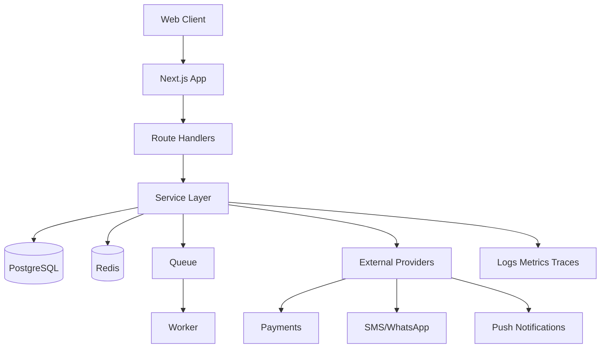

# Architecture

## Current System Architecture

The application is a Next.js App Router monolith with frontend routes and lightweight API handlers in a single codebase.

### Layers
1. Presentation Layer
- Route pages under src/app
- Shared shell and reusable UI primitives under src/components

2. API Layer
- Next.js route handlers under src/app/api
- Request validation via zod

3. Domain Rules Layer
- Stateless business rules in src/lib/domain.ts

4. Data Layer (Current)
- In-memory static data files (src/lib/mock-data.ts, src/lib/experience-data.ts)

### Constraints
- No persistence
- No auth/session
- No RBAC
- No async job processing

## Target Production Architecture

## Recommended Component Boundaries
- src/server/auth: session and token handling
- src/server/services: order, subscription, support, reporting services
- src/server/repositories: DB access layer
- src/server/events: event publishing and background jobs
- src/contracts: API DTOs and schemas

## Architectural Decisions for Sprint 0
1. Database: PostgreSQL 15+
2. ORM/migrations: SQL-first migrations (kept in /database/migrations)
3. Cache/queue: Redis
4. Auth model: OTP + signed session cookies + RBAC
5. Observability: OpenTelemetry-compatible logging/tracing

## Non-Functional Goals
- P95 API latency < 300 ms for read endpoints
- 99.9% monthly availability target for production
- Strict auditability for privileged operations

## Risks and Mitigations
- Risk: UI-first assumptions inflate completion confidence
  - Mitigation: enforce API-first completion criteria in backlog and sprint definitions
- Risk: Missing persistence blocks QA
  - Mitigation: deliver schema + migrations + seed in sprint 0
- Risk: Security debt accumulates
  - Mitigation: gate release on Security-Guide controls
