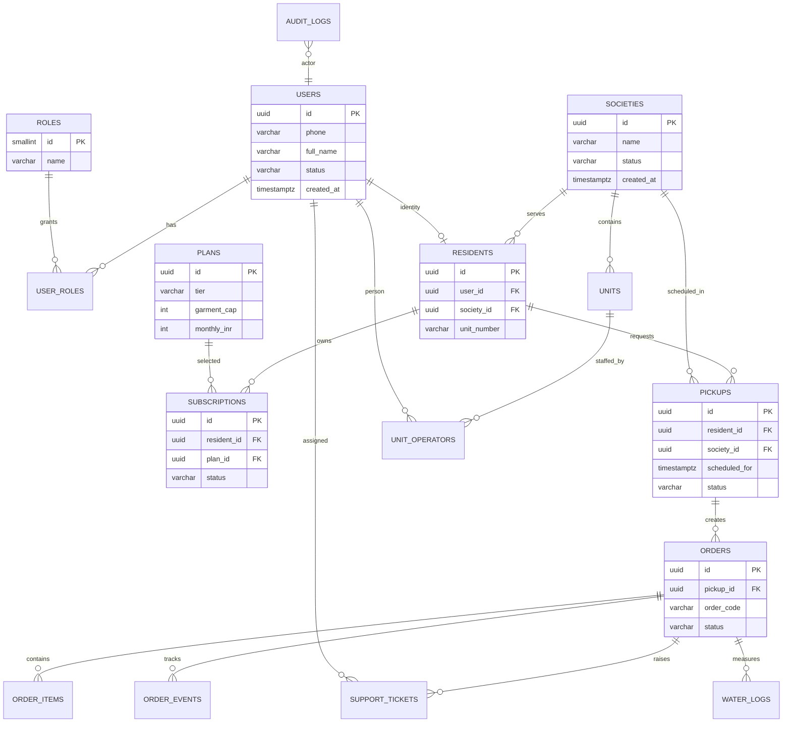

# Database Design

## Overview
This design provides a production-ready relational model for the Wash N Press platform.

Database engine target: PostgreSQL 15+

## ER Diagram

## Schema Principles
1. UUID primary keys for distributed-safe identity.
2. Strict foreign keys and check constraints.
3. Soft-delete ready pattern for recoverability where needed.
4. Audit log table for privileged actions and workflow transitions.
5. Indexed status + time columns for operational dashboards.

## Migration Files
- database/migrations/001_init_schema.sql
- database/migrations/002_indexes_and_constraints.sql
- database/migrations/003_audit_tables.sql

## Seed Files
- database/seeds/001_seed_reference_data.sql
- database/seeds/002_seed_demo_data.sql

## Audit Strategy
- Use audit_logs for admin/security-sensitive actions.
- Use order_events as domain event history for lifecycle traceability.
- Retain immutable actor, action, before_state, after_state snapshots.

## Backup and Recovery Guidance
- Daily full backups + point-in-time WAL archive.
- Validate restore in non-production weekly.
- Retention recommendation: 30 days daily + monthly snapshots for 12 months.
